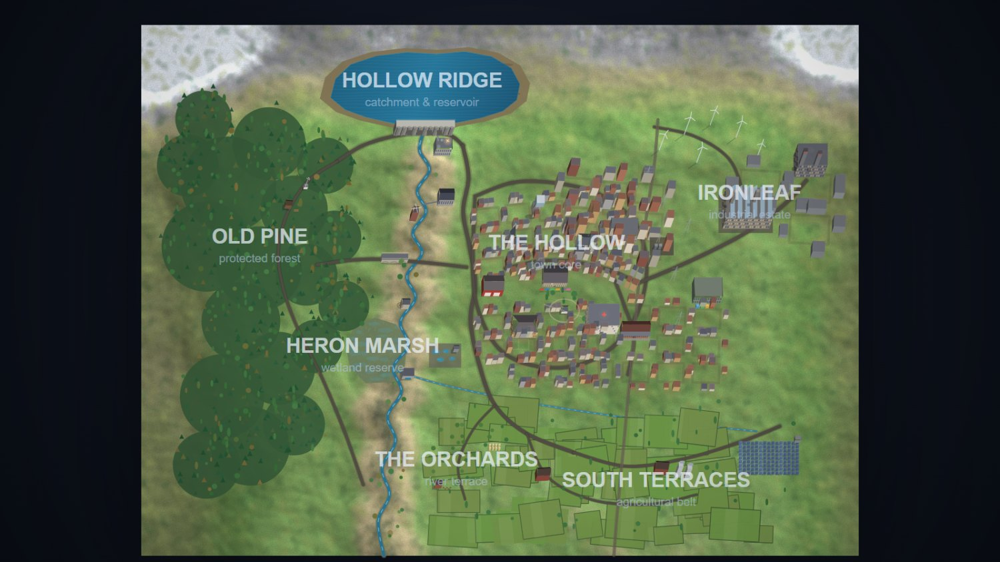
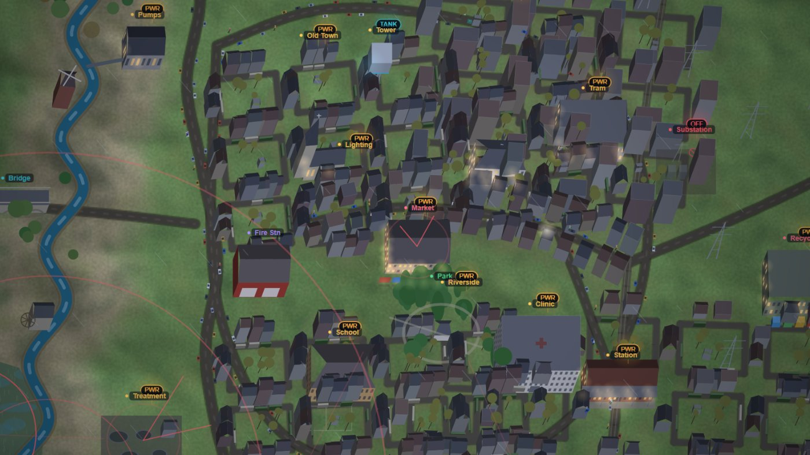

# Butterfly Effect — Verdant Hollow

A valley town where nothing stands alone. Rain fills the dam, the dam spins the turbine,
the turbine powers the pumps, the pumps water the fields, the fields feed the town, the town
breathes the air the forest cleans — and the forest only grows because it rained.

Switch any one of the **30 systems** off and watch the consequence travel the network.



## Run it

Double-click `index.html`. No build step, no dependencies, works offline straight off the
filesystem.

If you'd rather serve it over HTTP (some browsers are stricter about `file://`):

```bash
node serve.js
```

then open <http://localhost:5173>.

## What you can do

| Action | Result |
| --- | --- |
| **Hover** a structure | Live readings, plus a 34-hour forecast of what breaks if you switch it off |
| **Click** it | Full dossier: gauges, delta bars, upstream/downstream dependencies, history trace |
| **Double-click**, or `X` | Toggle it on/off — a ripple wave travels the dependency graph |
| **Scroll / drag** | Zoom and pan. Detail fades in with zoom; district labels fade in when you pull back |
| **Scenarios** (`1`–`9`) | Monsoon, drought, heatwave, gale, windless week, industrial boom, population surge, substation fault, mass planting, clear-felling |
| **Overlays** | `G` dependency graph · `W` wind field · `H` heat island · `A` air-quality haze · `P` townsfolk · `B` labels |
| **`L`** | Collapse the side panels and hand the whole screen to the valley |
| **Transport** | `Space` pause · `R` restart · `F` fit · `+`/`-` zoom · `Esc` close panel |

## You read the town, not a dashboard

The HUD is deliberately thin — four vitals and a clock. Everything else is meant to be seen
happening:

- **Systems in trouble wear a badge** above them on the map — `OFF`, `PWR`, `H2O`, `FIRE`,
  `CROP`, `TANK`, `HAZE` — pulsing, with a stem down to the building.
- **A quarter that loses power goes cold and grey**, in daylight as well as at night, and its
  windows go dark.
- **Gardens brown and shrink** when the taps run dry; crops yellow when the canal shuts.
- **Chimneys smoke** when the temperature drops, **dust lifts** off bare ground in a drought,
  **haze thickens** as the air gets worse, and the birds stop flying over a burning valley.
- Events arrive as **transient toasts** that fade, rather than accumulating in a table.


*The same streets with the substation switched off: badges on every affected system, the quarter
gone cold and grey, gardens browning.*

Night is moonlight, not a power cut: the town stays readable after dark, and the substation
fault fades the grid down over an hour rather than snapping it to zero.

## The important bit: the forecasts are real

The "if you switch this off" numbers are not written by hand. When you hover something, the
simulation **forks the world**, flips that one switch, runs *both* futures forward 34 simulated
hours at a coarse step, and diffs them. Weather is a deterministic function of the clock and a
seed, so both timelines get identical weather and the only difference is the thing you touched.
That is why the answers change with the season, the reservoir level and the wind.

It tracks the **worst point** reached during the window as well as the endpoint, because some
systems are buffers — a water tower changes nothing about where you end up and everything about
how bad it gets on the way there. Deltas that come from the trough rather than the endpoint are
labelled *at worst*.

A few systems are honest about being insurance. The fire station and the weather station report
"no measurable change" in calm conditions, with an explanation of the conditions under which they
suddenly matter, rather than a fabricated number.

The cascade path shown underneath (`Forest → Dam → Hydro → Substation → Pumps`) is traced through
a weighted dependency graph of **76 edges**.

## What's modelled

**Hydrology** — rainfall × catchment quality (a wooded slope captures, a bare slope flashes off),
reservoir storage, evaporation against temperature, gate release shared between turbines and the
irrigation canal, environmental flow to the marsh, spill over the crest, and a water tower that
buys the town about five hours of gravity-fed supply when the pumps stop.

**Electricity** — hydro as a function of head × release, wind on a cube curve with cut-in and
storm cut-out, solar cut by both cloud *and* haze, a dispatchable thermal plant deliberately too
small to cover a bad day alone, and load shedding when the sum falls short.

**Air** — emissions from thermal generation, industry, traffic and fire; uptake and dispersal
modelled as *rates* proportional to concentration, which is why a bare valley on a still day is
far worse than the sum of its emissions suggests.

**Land** — soil moisture from rain and irrigation, canopy growth and loss, deterministic wildfire
risk from dry ground plus heat, suppression from the fire station and the rain.

**People** — health from air, water, food, clinic capacity and heat stress; economy from industry
utilisation, harvest, orchard, tourism, rail freight and skills; wellbeing from all of it;
population drifting in response.

Feedback loops close: population drives demand drives emissions drives health drives wellbeing
drives population. Bees pollinate the farms and the orchard, and both feed the bees back. The
forest regulates the catchment that fills the dam that waters the soil that grows the forest.
The bridge carries no water and no power, and closing it still costs the works a fifth of its
workforce.

## How it's drawn

Oblique 2.5D on a single Canvas 2D context. World space is a plan view; height is a shear lift.
Footprints are arbitrary quads, so the generated buildings face the street they were laid along.

- **Generated urban fabric** — districts are grids of blocks; buildings are packed around each
  block's perimeter facing outward, with gardens, hedges, walls and sheds behind them. Streets are
  the gaps. ~400 buildings across five districts plus a high street of shopfronts.
- **Cast shadows** whose length and direction follow the sun through the day — long and raking at
  dawn, short and tight at noon. The whole fabric's shadows are drawn in one pass before any solid,
  in chunked paths (Canvas path building is superlinear in subpath count, so one giant path is 15×
  slower than the same geometry in chunks of 16).
- **Roofs** are gabled, hipped, mono-pitch or flat, with ridge lines, gable ends and chimneys.
- **Terrain** is baked once from a coarse elevation field with three scales of noise, meadow
  patchiness, and slope-driven rock so steep ground sheds soil and shows stone.
- **Level of detail** — glazing, chimneys, ridge lines, street furniture and tree tiers each switch
  on at their own zoom threshold; the forest is underlaid with a soft canopy mass at map scale that
  shrinks as the canopy is lost, so deforestation is legible from across the valley.
- **Performance** — the road network, streets and railway are baked into the terrain image rather
  than stroked every frame; buildings, props and trees are y-sorted and binary-searched to the
  visible band; shadows are filled in chunks of 16 because Canvas path building is superlinear in
  subpath count. Frame cost went from ~146 ms to ~13 ms at the worst zoom.

## Files

```
index.html        layout & panels
styles.css        the whole UI shell
js/noise.js       seeded RNG, value/fractal noise, easing
js/world.js       4600×3400 terrain field, water, roads, generated districts,
                  30 structures, 76 dependency edges
js/sim.js         the coupled model + the counterfactual engine
js/scenarios.js   ten perturbations (they only touch forcings — the rest is the model's doing)
js/agents.js      townsfolk, traffic, tram, branch-line train, smoke, spray, embers, birds, leaves
js/render.js      terrain baking, oblique 2.5D, sun-driven shadows, day/night, weather, overlays
js/ui.js          HUD, hover card, dossier, charts, event log
js/main.js        boot, input, camera, frame loop
serve.js          optional static server
```

Vanilla JavaScript and Canvas 2D. No frameworks, no build, no network calls.
